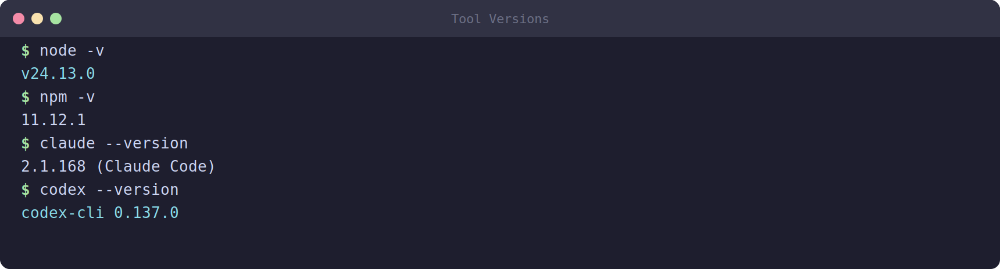

# 01 — Setting Up Your Environment



Before you touch any AI agent, your machine needs a working developer toolchain. GSD Core and the agent CLIs are built on **Node.js**, version control runs on **git**, and you'll talk to GitHub through the **GitHub CLI (`gh`)**. This module gets all four installed and verified.

> **Rule of thumb:** never start a project on a machine you haven't verified. A missing `node` or an unauthenticated `gh` will cause confusing failures three steps later.

## 1.1 The checklist

You need these four tools, at these minimum versions:

| Tool | Minimum version | What it's for |
|------|-----------------|---------------|
| **git** | 2.40 | Version control — every change is tracked |
| **Node.js** | 20 | Runtime for the agent CLIs and GSD Core |
| **npm** | comes with Node | Installs the agent CLIs |
| **GitHub CLI (`gh`)** | 2.40 | Repos, issues, pull requests from the terminal |

## 1.2 Installing on Ubuntu / WSL

If you're on Windows, we strongly recommend **WSL (Windows Subsystem for Linux)** — it gives you a real Linux environment that matches what servers run.

```bash
# Update package lists
sudo apt update

# git
sudo apt install -y git

# Node.js 20 (via NodeSource)
curl -fsSL https://deb.nodesource.com/setup_20.x | sudo -E bash -
sudo apt install -y nodejs

# GitHub CLI
type -p curl >/dev/null || sudo apt install curl -y
curl -fsSL https://cli.github.com/packages/githubcli-archive-keyring.gpg | sudo dd of=/usr/share/keyrings/githubcli-archive-keyring.gpg \
  && sudo chmod go+r /usr/share/keyrings/githubcli-archive-keyring.gpg \
  && echo "deb [arch=$(dpkg --print-architecture) signed-by=/usr/share/keyrings/githubcli-archive-keyring.gpg] https://cli.github.com/packages stable main" | sudo tee /etc/apt/sources.list.d/github-cli.list > /dev/null \
  && sudo apt update && sudo apt install gh -y
```

## 1.3 Installing on macOS

The easiest path on macOS is [Homebrew](https://brew.sh):

```bash
# Install Homebrew first if you don't have it
/bin/bash -c "$(curl -fsSL https://raw.githubusercontent.com/Homebrew/install/HEAD/install.sh)"

# Then the tools
brew install git
brew install node@20
brew install gh
```

## 1.4 Verifying everything

This is the most important step. Run each command and confirm the version meets the minimum:

```bash
git --version        # expect >= 2.40
node --version       # expect >= v20
npm --version        # any recent version
gh --version         # expect >= 2.40
```

A healthy output looks like:

```
git version 2.43.0
v20.11.0
10.2.4
gh version 2.45.0
```

If any command says `command not found`, that tool didn't install — go back and fix it before continuing. Do not skip ahead with a broken tool.

## 1.5 Configuring git identity

Git stamps every commit with your name and email. Set them once:

```bash
git config --global user.name "Your Name"
git config --global user.email "you@university.edu"

# Use 'main' as the default branch name
git config --global init.defaultBranch main
```

Use the **same email** you'll register with GitHub — this links your commits to your GitHub profile.

## 1.6 Authenticating with GitHub

The `gh` CLI needs to log in to your GitHub account so it can create repos and PRs on your behalf:

```bash
gh auth login
```

Answer the prompts:
- **What account?** → GitHub.com
- **Protocol?** → HTTPS
- **Authenticate Git with credentials?** → Yes
- **How to log in?** → Login with a web browser (it gives you a one-time code)

Verify you're logged in:

```bash
gh auth status
```

You should see your username and a confirmation that the token has the right scopes (`repo`, `workflow`, etc.).

## 1.7 A note on accounts you'll need

To follow the whole tutorial you'll want:

1. A **GitHub account** (free) — for hosting code and collaboration.
2. An **Anthropic account** with Claude Code access — for the Claude path.
3. An **OpenAI account** with API access — for the Codex path.

You don't need both agent accounts; pick the path you have access to. The tutorial covers both side by side.

**Expected costs:** Claude Code and Codex are paid tools or consume paid API/usage credits depending on your plan. Check Anthropic/OpenAI pricing before long sessions, set budgets where available, and monitor usage while you learn.

## 1.8 What's next

With your environment verified, you'll install an AI agent CLI — Claude Code or Codex.

➡️ Continue to [02 — Installing AI Agent CLIs](02-install-agent-cli.md)
