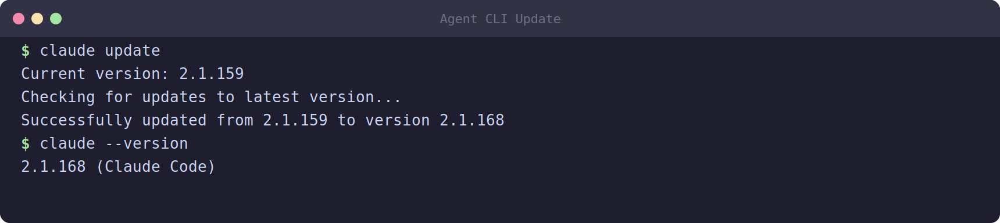

# 02 — Installing AI Agent CLIs



GSD Core drives an **AI coding agent** — but it doesn't ship one. You bring your own. This tutorial supports two of the most capable terminal agents: **Claude Code** (Anthropic) and **Codex** (OpenAI). Install whichever you have access to; both are covered throughout the tutorial.

> You only need **one** agent to complete the tutorial. If you have both, even better — you can compare them on the same project.

## 2.1 Path A — Claude Code

Claude Code is Anthropic's official CLI agent. It runs in your terminal, reads and edits files, runs commands, and follows multi-step plans.

### Install

```bash
npm install -g @anthropic-ai/claude-code
```

### Authenticate

Launch it once and follow the login flow:

```bash
claude
```

On first run it opens a browser-based OAuth login (or asks for an API key, depending on your plan). Once authenticated, the credentials are cached — you won't need to log in every time.

### Verify

```bash
claude --version
```

You should see a version number like `2.1.168`. If the command isn't found, check that npm's global bin directory is on your `PATH`.

### A quick smoke test

```bash
claude -p "Say hello and tell me what directory you're in."
```

The `-p` flag runs a one-shot prompt non-interactively — handy for scripting and for the screenshots in this tutorial.

## 2.2 Path B — Codex

Codex is OpenAI's terminal coding agent. It works the same way conceptually: read files, edit code, run commands.

### Install

```bash
npm install -g @openai/codex
```

### Authenticate

Codex authenticates with your OpenAI account. Run:

```bash
codex
```

Follow the login prompt. Depending on your setup it will either open a browser sign-in or ask for an API key. If it asks for a key, set it as an environment variable:

```bash
export OPENAI_API_KEY="sk-..."     # add to ~/.bashrc to persist
```

### Verify

```bash
codex --version
```

You should see a version number like `0.136.0`.

## 2.3 How the two map onto GSD Core

GSD Core writes slash-commands into whichever runtime you choose during installation (next module). The same workflow command has a slightly different *spelling* per runtime:

| Runtime | Command spelling | Example |
|---------|------------------|---------|
| Claude Code | hyphen form | `/gsd-new-project` |
| Codex | dollar form | `$gsd-new-project` |

They mean the same thing. The GSD installer writes the correct form for your runtime, so you don't have to memorize this — just know that what you see in Claude (`/gsd-...`) becomes `$gsd-...` in Codex.

## 2.4 Choosing your path

- **Have a Claude subscription?** → Use Path A (Claude Code). Most examples in this tutorial use Claude.
- **Have OpenAI API credits?** → Use Path B (Codex). Module 11 covers the Codex-specific workflow.
- **Have both?** → Install both. You can run them on separate git worktrees (Module 09) and compare.

## 2.5 Verification screenshot

Run both version checks together so you have proof your agents are ready:

```bash
claude --version
codex --version
```

Capture this output — it's your evidence that the agent layer is installed before you add GSD Core on top.

## 2.6 What's next

You have git, Node, GitHub CLI, and at least one AI agent. Now you'll install the framework that turns the agent into a disciplined engineer: **GSD Core**.

➡️ Continue to [03 — Installing GSD Core](03-install-gsd-core.md)
