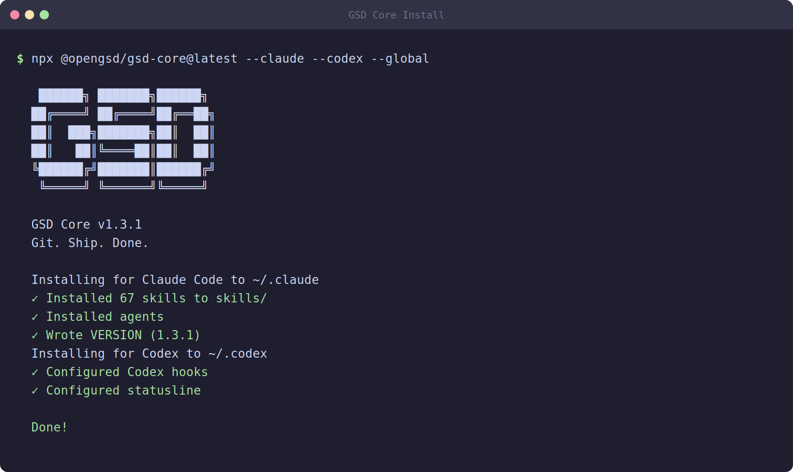

# 03 — Installing GSD Core

In the previous modules you set up your machine and got your AI coding agent ready. Now it is time to install the tool that turns your agent from a clever autocomplete into a disciplined software engineer: **GSD Core**.

This module walks you through what GSD Core is, how to install it, and what the installer puts on your machine. By the end you will have GSD Core working inside your agent and you will understand the commands you will use for the rest of this course.

## What is GSD Core?

**GSD Core** is an open-source, lightweight **spec-driven development framework**. The project lives at `open-gsd/gsd-core` and is published on npm as the package `@opengsd/gsd-core`.

The name "GSD" stands for *Get Stuff Done*. The idea behind the framework is simple but powerful: instead of asking your AI agent to "just build the app" in one giant conversation, GSD Core breaks the work into clear, structured steps. You write a specification first, the agent plans around it, and then the agent executes that plan in controlled stages.

"Spec-driven" means the **specification comes first**. Before any code is written, GSD Core helps you capture:

- *What* you are building (the vision and scope)
- *Why* you are building it (the requirements)
- *How* it will be delivered (a phased roadmap)

These artifacts are saved as plain markdown files on disk. That is the magic ingredient — your project's plan does not live inside a chat window that disappears when you close it. It lives in files that survive across sessions, machines, and even different team members.

GSD Core is deliberately **lightweight**. It is not a heavy IDE plugin or a cloud service. It is a small set of slash-commands and instruction files that plug into the AI coding agent you already use. Whether you run Claude Code, Codex, or Gemini CLI, GSD Core adds the same structured workflow on top.

## Installing GSD Core

Installation is a single command. Open your terminal, then run:

```bash
npx @opengsd/gsd-core@latest
```

`npx` is a tool that ships with Node.js. It downloads and runs an npm package without permanently installing it first, which is perfect for an installer like this one. The `@latest` tag makes sure you always get the newest published version.

> **Heads up:** You need Node.js installed for `npx` to work. If you followed Module 01, you already have it. If `npx` is "command not found", go back and install Node.js before continuing.

The installer is **interactive**. That means it does not silently dump files everywhere — instead it asks you a few questions and lets you choose how GSD Core is set up. Read each prompt carefully and answer based on your situation.

### The installer asks two main things

**1. Which runtime (agent) are you using?**

GSD Core supports several AI coding agents. The installer will show a list similar to this:

- **Claude Code** — Anthropic's official CLI agent
- **Codex** — OpenAI's coding agent
- **Gemini CLI** — Google's command-line agent
- *(and other supported runtimes)*

You pick the one you actually use. This matters because each agent stores its commands and context files in a different place, and GSD Core needs to install the files in the right spot for *your* agent. If you are following this course with Claude Code, choose Claude Code.

**2. Global or local install (the scope)?**

- **Global** — GSD Core's commands become available everywhere on your machine, in every project. Choose this if you plan to use GSD Core across many projects.
- **Local** — GSD Core is installed only inside the current project folder. Choose this if you want the framework scoped to one repository, or if you are working on a shared machine and do not want to touch global settings.

For this course, either choice works. A **global** install is the most convenient because the commands will be ready in any folder you open. If you are unsure, pick global.

## What gets installed

Once you answer the prompts, GSD Core copies a small number of files onto your machine. The two important categories are:

### 1. Slash-commands

GSD Core installs a set of **slash-commands** into your agent's command directory. The exact location depends on the runtime you picked, but for Claude Code these land in the agent's commands folder where it looks for custom commands.

A slash-command is just a command you type inside your agent's chat, starting with a `/`. For example, typing `/gsd-new-project` triggers the GSD Core "new project" workflow. You will use these constantly.

### 2. A context file (CLAUDE.md or equivalent)

GSD Core also creates a **context file** that tells your agent how to behave when using the framework. For Claude Code this file is called `CLAUDE.md`. Other agents use their own equivalent (for example, an `AGENTS.md` or a similar instructions file). This file is the agent's "house rules" — it is loaded automatically so the agent always knows the GSD workflow.

You generally do not need to edit these files by hand. The installer sets them up correctly for you.

## The key commands

GSD Core gives you a small, focused set of commands. Each one represents a stage in the development workflow. Here is your cheat sheet — you will return to this table often.

- **`/gsd-new-project`** — Initialize a project. Gathers deep context about what you are building and creates the planning artifacts.
- **`/gsd-discuss-phase N`** — Capture implementation decisions for phase *N* *before* any planning happens. This is where you make the important choices.
- **`/gsd-plan-phase N`** — Research, decompose the work into tasks, and verify the plan actually fits inside the agent's context window.
- **`/gsd-execute-phase N`** — Run the plans for phase *N* in **parallel waves** (several tasks at once, in safe batches).
- **`/gsd-verify-work N`** — Run UAT (User Acceptance Testing) with automatic diagnosis of failures.
- **`/gsd-ship`** — Create a pull request and archive the finished phase.
- **`/gsd-progress`** — Check the current status of your project at any time.
- **`/gsd-workspace`** — Manage isolated workspaces so parallel work does not collide.

The `N` in commands like `/gsd-discuss-phase N` is the **phase number**. So `/gsd-discuss-phase 1` works on phase 1, `/gsd-plan-phase 2` plans phase 2, and so on. You will learn the roadmap and phases in the next module.

The typical flow for a single phase looks like this:

```
discuss → plan → execute → verify → ship
```

You discuss the decisions, plan the tasks, execute them, verify the result works, and ship it. Then you repeat for the next phase.

## The `.planning/` directory

When you run `/gsd-new-project`, GSD Core creates a special folder in your project called `.planning/`. This folder is the **brain** of your project — it holds all the structured artifacts that survive between sessions.

The structure looks like this:

```
.planning/
├── PROJECT.md         # Vision, scope, and constraints
├── REQUIREMENTS.md    # Numbered functional & non-functional requirements
├── ROADMAP.md         # The phased delivery plan
├── STATE.md           # Tracks the current phase and progress
├── config.json        # GSD Core configuration
└── research/          # Domain research artifacts the agent gathers
```

Here is what each piece does:

- **`PROJECT.md`** — The high-level vision of what you are building, its scope, and any constraints.
- **`REQUIREMENTS.md`** — A numbered list of requirements. Functional requirements get F-IDs (like F-1, F-2) and non-functional ones get NF-IDs (like NF-1).
- **`ROADMAP.md`** — The plan broken into phases, so you build the project step by step.
- **`STATE.md`** — A live tracker showing which phase you are on and how far along you are. This is how GSD Core "remembers" where you left off.
- **`config.json`** — Settings for the framework.
- **`research/`** — A folder where the agent stores any research it does about your problem domain.

You will see all of these files created with real content in the next module.

## Why GSD Core matters

You might be wondering: why bother with all this structure? Why not just chat with the agent and let it build things?

The answer comes down to three big problems that GSD Core solves.

### 1. It prevents context rot

AI agents have a **context window** — a limited amount of text they can "remember" in a single conversation. As you keep chatting, that window fills up with old messages, code, and discussion. When it gets too full, the quality of the agent's output starts to **degrade**: it forgets earlier decisions, repeats mistakes, and loses track of the plan. This decline is called **context rot**.

GSD Core fights context rot by keeping the important information in files on disk, not in the chat history. The agent reads only what it needs for the current step. The context window stays clean, so the quality stays high.

### 2. Structured artifacts survive sessions

Because your vision, requirements, and roadmap live in `.planning/` files, they do not vanish when you close your terminal or restart your computer. You can stop working on Monday and pick up exactly where you left off on Tuesday — the agent simply reads `STATE.md` and continues. This also makes it easy to share the project with teammates; they read the same files and instantly understand the plan.

### 3. Parallel wave execution

When it is time to build, `/gsd-execute-phase N` does not crawl through tasks one at a time. It runs them in **parallel waves** — batches of independent tasks executed together. This is faster and mirrors how a real engineering team divides work. The framework handles the coordination so nothing collides.

Together, these three features turn your AI agent into something far more reliable than ad-hoc chatting.

## A note for Codex users

If you chose **Codex** as your runtime during installation, your commands use a **dollar prefix** (`$`) instead of a slash. So everywhere this course writes a slash-command, you would type the dollar version:

| Claude Code (slash)      | Codex (dollar)           |
|--------------------------|--------------------------|
| `/gsd-new-project`       | `$gsd-new-project`       |
| `/gsd-discuss-phase N`   | `$gsd-discuss-phase N`   |
| `/gsd-plan-phase N`      | `$gsd-plan-phase N`      |
| `/gsd-execute-phase N`   | `$gsd-execute-phase N`   |

The behaviour is identical — only the prefix changes. From here on, this course mostly uses the `/` form. If you are on Codex, just swap `/` for `$` in your head.

## Verifying your install

After the installer finishes, open your agent and type the start of a command to see if GSD Core's commands appear in the autocomplete list. If you can see `/gsd-new-project` (or `$gsd-new-project` on Codex), your installation succeeded.



## Recap

In this module you:

- Learned that **GSD Core** is a lightweight, spec-driven development framework (`@opengsd/gsd-core`).
- Installed it with `npx @opengsd/gsd-core@latest`.
- Answered the interactive installer's questions about **runtime** and **scope** (global vs local).
- Saw what gets installed: **slash-commands** and a **context file** (`CLAUDE.md` or equivalent).
- Met the **key commands** and the `discuss → plan → execute → verify → ship` flow.
- Understood the **`.planning/`** directory and why structured artifacts beat endless chatting (no context rot, work survives sessions, parallel waves).
- Noted that **Codex** users use the `$` prefix.

You now have a working GSD Core install. Time to put it to work and create your first real project.

---

Next: [04 — Starting a New Project](04-new-project.md)
