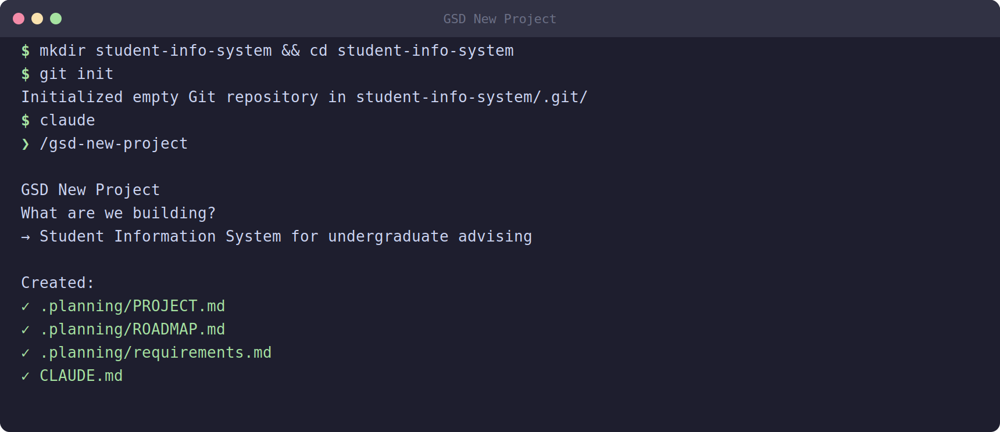

# 04 — Starting a New Project



Every GSD-driven project starts with one command: **`/gsd-new-project`**. This is where the agent becomes an architect — not a coder. It asks you a structured set of questions, then produces the planning artifacts that every subsequent command depends on. You do not write a single line of application code until this step is complete and reviewed.

> **Codex users:** use `$gsd-new-project` (dollar prefix) everywhere you see `/gsd-new-project`.

## 4.1 Before you run it

Create and enter your project directory. This is also where you'll initialize git:

```bash
mkdir library-management && cd library-management
git init
git branch -m main
```

Then open your agent:

```bash
claude          # Claude Code path
# or
codex           # Codex path
```

## 4.2 Running /gsd-new-project

Inside your agent session, type:

```
/gsd-new-project
```

The agent begins an **adaptive interview** — it asks questions about your project and adjusts follow-ups based on your answers. You don't need to prepare anything; just answer honestly and in as much detail as you have.

A typical session looks like this:

```
GSD › What is the name of this project?
> Library Management System

GSD › Describe the problem this system solves. Who has this problem?
> Students at our university can't easily find or borrow books.
  Librarians have to manage everything in spreadsheets. We need
  a digital system.

GSD › Who are the primary users? List each user type and their main goal.
> Students: search the catalog, borrow and return books, see due dates
  Librarians: add/edit/remove books, approve borrowing requests,
  track overdue books

GSD › List the key features you need. Be specific.
> 1. User login and registration (separate roles for student/librarian)
  2. Book catalog with search and filter
  3. Borrow request and approval flow
  4. Return tracking and overdue alerts via email
  5. Librarian dashboard with borrowing stats

GSD › Any technology preferences or constraints?
> Backend: Python (FastAPI preferred), Frontend: React,
  Database: PostgreSQL, must run in Docker

GSD › What is out of scope for this project?
> Payment, e-book reading, mobile app

GSD › Any hard deadlines or team size constraints?
> 4-person student team, 4-week timeline
```

## 4.3 What it produces

After the interview, the agent generates a set of structured planning files in a `.planning/` directory:

```
library-management/
├── .planning/
│   ├── PROJECT.md        # Vision, scope, constraints — human-readable
│   ├── REQUIREMENTS.md   # Numbered F-IDs and NF-IDs
│   ├── ROADMAP.md        # Phased delivery plan
│   ├── STATE.md          # Tracks current phase and progress
│   ├── config.json       # GSD configuration
│   └── research/         # Domain research from subagents
├── CLAUDE.md             # Agent context file (or AGENTS.md for Codex)
└── (no source code yet)
```

### PROJECT.md

The vision and scope document. Written in plain language. It captures:
- What problem you're solving and for whom
- What the system will and won't do (scope)
- Hard constraints (tech stack, team, timeline)

### REQUIREMENTS.md

Numbered, traceable requirements. Every feature becomes an **F-ID** (functional) or **NF-ID** (non-functional):

```
F01  Users can register with email, password, and role (student/librarian)
F02  Users can log in with JWT-based authentication
F03  Students can search the book catalog by title, author, or ISBN
F04  Students can submit a borrow request for an available book
F05  Librarians can approve or reject borrow requests
F06  The system tracks return due dates and marks overdue books
F07  Librarians can add, edit, and remove books from the catalog
F08  Overdue notifications are sent via email

NF01 All API responses complete in under 2 seconds under normal load
NF02 Passwords are hashed with bcrypt; sessions use JWT with 1-hour expiry
NF03 The frontend is responsive on screens 375px and wider
```

These IDs are the backbone of your whole project. Every phase, every PR, every test traces back to an F-ID or NF-ID.

### ROADMAP.md

The phased delivery plan. GSD breaks the requirements into phases where each phase is independently shippable:

```
Phase 1 — Foundation
  Goals: project skeleton, database schema, authentication
  Requirements: F01, F02, NF02

Phase 2 — Book Catalog
  Goals: book search, display, librarian CRUD
  Requirements: F03, F07

Phase 3 — Borrowing System
  Goals: borrow/return flow, overdue tracking, email alerts
  Requirements: F04, F05, F06, F08

Phase 4 — Dashboard & Polish
  Goals: librarian stats dashboard, UI polish, performance
  Requirements: NF01, NF03
```

### STATE.md

GSD's session memory. It records which phase you're on, what's been completed, and any open issues. Every GSD command reads this file first.

### CLAUDE.md / AGENTS.md

The agent context file. This tells the agent (at the start of every session) what this project is, what the stack is, and what conventions to follow. You never need to re-explain the project — the agent reads this file automatically.

## 4.4 Auto-extract mode

If you already have a written project brief (e.g. a Word document, a PDF spec, or an existing markdown file), you can skip the interview:

```bash
# Convert your existing document to markdown first, then:
/gsd-new-project --auto @project-brief.md
```

The agent extracts requirements from your document and generates the same `.planning/` structure. Review the output carefully — auto-extraction is fast but may miss nuances in informal writing.

## 4.5 The mandatory gate

**Do not proceed to the next step until you have reviewed these two files:**

```bash
cat .planning/PROJECT.md
cat .planning/ROADMAP.md
```

Check:
- Does PROJECT.md correctly describe your problem and scope?
- Are all your features captured as F-IDs in REQUIREMENTS.md?
- Does the ROADMAP group requirements into sensible, independently shippable phases?
- Is anything missing or wrong?

If yes to all — you pass the gate. If not — tell the agent what's wrong and ask it to revise:

```
The ROADMAP is missing email notifications (F08). Add it to Phase 3.
Also, NF01 (performance) should be checked in Phase 4, not Phase 1.
```

The agent updates the files. You review again. This is not a bureaucratic step — it is the entire reason GSD produces good software.

## 4.6 Commit your planning artifacts

Once the planning files are approved, commit them:

```bash
git add .planning/ CLAUDE.md
git commit -m "docs: add GSD planning artifacts — PROJECT.md, REQUIREMENTS.md, ROADMAP.md"
```

Your team members can now clone the repo and immediately understand the entire project from these files — without asking you anything.

## 4.7 What's next

Planning docs approved and committed. Now go deeper into Phase 1 decisions with the Discuss command.

➡️ Continue to [05 — Capturing Decisions with /gsd-discuss-phase](05-discuss-phase.md)
