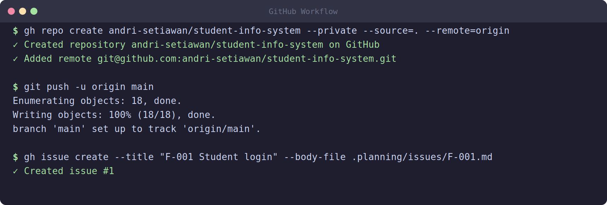

# 08 — GitHub Workflow for Agent-Driven Development

## Why GitHub Matters When You're Working with AI

You might think: "If the AI agent is writing the code, why do I need a complex GitHub workflow?"

Here's why. The AI agent can write thousands of lines of code in minutes. Without version control, you have **no undo button**, **no audit trail**, and **no way to collaborate**. A single hallucination or wrong architectural decision can cascade through your entire codebase. GitHub gives you checkpoints, review checkpoints, and the ability to experiment freely.

In agent-driven development, your GitHub workflow is a **safety net** as much as a collaboration tool.

## Creating the Repository

### Option A: via GitHub Web

Go to github.com, click the green "New" button, and create a new repository. Don't check "Add a README" or any templates — you'll let the agent set those up.

### Option B: via CLI (Recommended)

Install the GitHub CLI (`gh`) if you haven't already:

```bash
# Ubuntu/Debian (add GitHub's official package repo first)
type -p curl >/dev/null || sudo apt install curl -y
curl -fsSL https://cli.github.com/packages/githubcli-archive-keyring.gpg | sudo dd of=/usr/share/keyrings/githubcli-archive-keyring.gpg \
  && sudo chmod go+r /usr/share/keyrings/githubcli-archive-keyring.gpg \
  && echo "deb [arch=$(dpkg --print-architecture) signed-by=/usr/share/keyrings/githubcli-archive-keyring.gpg] https://cli.github.com/packages stable main" | sudo tee /etc/apt/sources.list.d/github-cli.list > /dev/null \
  && sudo apt update && sudo apt install gh -y

# macOS
brew install gh
```

Authenticate:

```bash
gh auth login
```

Create your repo:

```bash
# From your project folder
cd ~/projects/library-system
gh repo create library-system --public --source=. --remote=origin --push
```

This creates the repo on GitHub, links it as the `origin` remote, and pushes your existing code.

If you're starting from scratch:

```bash
# Create remote repo, clone locally
gh repo create library-system --public --clone
cd library-system
```

### What to Push First

Your initial commit should include:

- Project scaffold (PROJECT.md, ROADMAP.md, basic structure)
- .gitignore (Python: `**/__pycache__/`, `.venv/`, `.env`; Node: `node_modules/`)
- README.md with project overview

The agent can help you create all of these.

## Branching Strategy

The ISD branching strategy is simple:

```
main ─── feature/phase-1-auth ─── feature/phase-2-catalog ─── ...
```

- **`main`**: Always deployable. What's on `main` should work.
- **`feature/*` branches**: One branch per phase or per feature. Work happens here, then gets merged back to `main`.

### Why One Branch Per Phase?

Each phase in your ROADMAP.md is a self-contained unit of work. By giving each phase its own branch:

- The agent can work on Phase 2 without affecting Phase 1's code
- You can review Phase 1's code independently
- If Phase 3 goes wrong, it doesn't touch Phase 2's working code
- Multiple agent sessions can work on different branches

### Branch Naming Convention

```
feature/phase-01-book-catalog
feature/phase-02-user-auth
feature/phase-03-borrowing
feature/phase-04-reports
```

Or for individual features:

```
feature/F-001-book-crud
feature/F-002-book-detail
```

Choose one convention and stick with it.

## Creating Issues from Requirements

Every feature in your ROADMAP (F-001, F-002, etc.) should become a GitHub issue. This creates traceability from requirements to code.

```bash
# Create an issue via CLI
gh issue create \
  --title "F-001: Book Catalog CRUD" \
  --label "phase-1" \
  --body "## Description
Users can create, read, update, and delete books in the catalog.

## Acceptance Criteria
- [ ] Create book with title, author, ISBN, genre
- [ ] List books with pagination
- [ ] Update book details
- [ ] Delete (soft) a book
- [ ] Only admins can create/update/delete

## Tech Notes
- Uses Django + HTMX
- Admin panel for CRUD
- Public listing page"
```

**F-IDs should be recorded alongside their GitHub issue numbers.** If F-001 becomes issue #3, note that mapping (e.g., in a comment in ROADMAP.md or the issue body). The agent can track this.

### Automating Issue Creation

You can prompt the agent to create issues for all features:

> "Create GitHub issues for all F-IDs in ROADMAP.md, organized by phase."

The agent will read your roadmap and create the issues automatically (assuming you provided your GitHub token).

## The PR Lifecycle

Here's the flow for every phase:

```
1. Branch  ──→  2. Code  ──→  3. Commit  ──→  4. Push  ──→  5. PR  ──→  6. Review  ──→  7. Merge
```

### Step 1: Create a Branch

```bash
git checkout -b feature/phase-01-book-catalog
```

Or, create it from an issue:

```bash
gh issue develop 3 --name feature/phase-01-book-catalog
```

### Step 2: Write Code (with Agent)

The agent works on the current branch, creating files, running tests, and making commits. Each **wave** from your plan typically results in one or more commits.

### Step 3: Commit Changes

```bash
git add backend/api/books.py
git commit -m "feat: implement book listing endpoint with search"
```

Good commit messages in agent-driven development:

| Bad | Good |
|---|---|
| "fix things" | "fix: ISBN validation rejects 10-digit input" |
| "add stuff" | "feat: add book search by title and author" |
| "update" | "refactor: extract book search into service layer" |

The agent can write commit messages for you, but review them before committing.

### Step 4: Push to GitHub

```bash
git push -u origin feature/phase-01-book-catalog
```

This creates the remote tracking branch.

### Step 5: Create a Pull Request

```bash
gh pr create \
  --title "Phase 1: Book Catalog" \
  --body "Closes #3, #4
  - Implemented book CRUD API
  - Created catalog listing page
  - Added admin book management
  - Included search and pagination

  Note: Cover image upload deferred to Phase 2" \
  --label "phase-1"
```

The PR body should:

- Reference related issues ("Closes #3")
- Summarize what was built
- Note any deviations from the plan
- Flag anything incomplete or deferred

### Step 6: Review the PR

This is another **GATE**. Review the PR carefully:

1. **Read the diff**: Don't just trust the agent — look at the actual changes
2. **Check for security**: Are there any hardcoded secrets? Exposed endpoints?
3. **Verify the plan**: Does the code match what was agreed in the plan?
4. **Run tests**: `gh pr checks` or manual testing
5. **Check style**: Does it follow project conventions?

### Step 7: Merge

```bash
gh pr merge 5 --merge --delete-branch
```

Or via the GitHub UI: click "Merge pull request" then "Delete branch."

After merging, pull the changes back to your local `main`:

```bash
git checkout main
git pull
```

## Full Workflow Example

Here's the complete lifecycle for Phase 1 of the Library System:

```bash
# 1. Create branch
cd ~/projects/library-system
git checkout main
git pull
git checkout -b feature/phase-01-book-catalog

# 2. Run discussion and planning
/gsd-discuss-phase 1
/gsd-plan-phase 1

# 3. Approve the plan and start execution
# (agent writes code for each wave)

# 4. Commit Wave 1 (Database)
git add backend/migrations/
git commit -m "feat: create books table migration with seed data"

# 5. Commit Wave 2 (API)
git add backend/api/
git commit -m "feat: implement book CRUD API endpoints"

# 6. Commit Wave 3 (Frontend)
git add frontend/
git commit -m "feat: add book catalog and detail pages"

# 7. Commit Wave 4 (Tests)
git add tests/
git commit -m "test: add API and frontend tests for catalog"

# 8. Push branch
git push -u origin feature/phase-01-book-catalog

# 9. Create PR
gh pr create \
  --title "Phase 1: Book Catalog" \
  --body "Closes #3, #4" \
  --label "phase-1"

# 10. Review (ask a teammate or reviewer to approve), then merge
# A team member reviews and approves via GitHub UI or:
#   gh pr review 5 --approve  (only valid if reviewing SOMEONE ELSE's PR)
gh pr merge 5 --merge --delete-branch

# 11. Sync main
git checkout main
git pull
```

## Screenshots



## Common Issues and Solutions

| Problem | Solution |
|---|---|
| Agent commits to `main` by mistake | `git reset HEAD~1` and checkout to feature branch |
| PR too large to review | Split phase into smaller sub-phases |
| Merge conflicts | Resolve locally before merging |
| Agent introduces bugs | PR review should catch them; write tests for critical paths |
| Forgot to create a branch | `git stash`, create branch, `git stash pop` |

## Summary

| Step | Command/Action | GATE? |
|---|---|---|
| Create repo | `gh repo create` | No |
| Create issue | `gh issue create` | No |
| Create branch | `git checkout -b feature/...` | No |
| Write code | Agent execution | No |
| Commit | `git commit -m "..."` | No |
| Push | `git push -u origin` | No |
| Create PR | `gh pr create` | No |
| Review PR | Read diff, check tests | ✅ YES |
| Merge | `gh pr merge` | No |

**Remember**: The PR review is your last chance to catch problems before code lands on `main`. Don't rush it.

**Next**: Ready for parallel team development? See [09 — Team Collaboration with Git Worktrees](09-worktree-teamwork.md).
