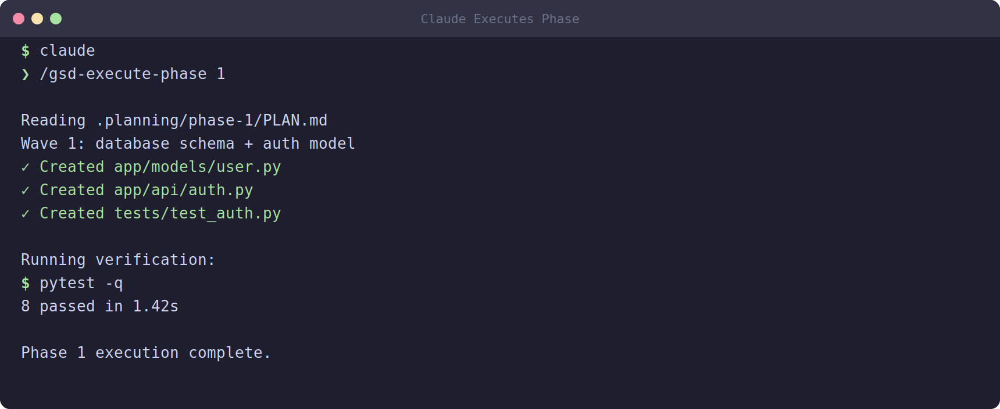

# 10 — Building with Claude Code + GSD Core

You have planned. You have requirements written down, a `PLAN.md` that breaks the work into tasks, and a clear picture of what "done" looks like. Now comes the part everyone is waiting for: actually building the thing. In this module you will hand your planning documents to an AI coding agent — Claude Code — and watch it turn your specification into working software.

This is where the GSD (Get Stuff Done) Core workflow really shines. Instead of you typing out every file by hand, you point the agent at your plan and let it execute. But "let it execute" does not mean "walk away and hope." You stay in the loop. This module shows you exactly how.

## What `/gsd-execute-phase` does

The core command for building is:

```
/gsd-execute-phase 1
```

You run this inside a Claude Code session. The `1` is the phase number — your project is broken into phases, and you build one phase at a time. (Phase 2 comes after Phase 1 is verified and shipped, which you will learn in Module 12.)

When you run this command, GSD Core reads your `PLAN.md` for that phase and orchestrates the build. The magic is in *how* it builds. It does not try to do everything in one giant conversation. Instead, it splits the work into **parallel waves**, and each task is handled by a fresh executor (a subagent) that starts with a clean, empty 200,000-token context window.

Why does the fresh context matter? Imagine you are doing homework for six different subjects in one sitting. By the time you reach the sixth, your brain is cluttered with the first five — you make mistakes, you forget instructions. AI agents have the same problem: the longer a single conversation runs, the more "polluted" its context becomes with old details, and the more likely it is to drift, hallucinate, or forget the original spec. By giving each task a brand-new context, GSD keeps every executor sharp and focused on exactly one job.

## The wave system

A "wave" is a group of tasks that can run **at the same time** because none of them depend on each other.

Here is the idea in plain terms:

- **Wave 1** — Tasks that have no prerequisites. These all run in parallel. For example: "create the database schema," "set up the project skeleton," and "write the config loader" might all be independent, so they launch together.
- **Wave 2** — Tasks that depend on Wave 1 finishing. For example: "build the user model" needs the database schema to exist first, so it waits until Wave 1 is complete, then runs.
- **Wave 3, 4, ...** — Each later wave depends on the waves before it.

Think of it like building a house. You can pour the foundation, order the lumber, and hire the electrician's schedule all at once (Wave 1). But you cannot frame the walls until the foundation is set (Wave 2), and you cannot paint until the walls are framed (Wave 3). GSD figures out these dependencies from your `PLAN.md` and sequences the waves automatically.

The payoff: parallelism makes building dramatically faster, while the wave ordering guarantees nothing is built on top of something that does not exist yet.

## Pointing the agent at your plan

Getting started is simple:

1. Open a terminal and `cd` into your **project root** — the top folder that contains your `.planning/` directory and `PLAN.md`.
2. Launch Claude Code by typing `claude` (or open it through your editor's integration).
3. Once the session is running, type the command:

```
/gsd-execute-phase 1
```

That is it. The agent now has everything it needs: it knows where your planning docs live, it reads them, and it starts working.

A common beginner mistake is launching Claude Code from the wrong directory. If you start it from your home folder or a subfolder, it may not find your planning documents. Always start from the project root.


*Illustrative example — your terminal output will look similar but will differ based on your project and system.*

## What Claude Code actually does during execution

Once you run the command, here is the sequence of events under the hood:

1. **Reads `PLAN.md`** — The agent parses the phase plan, identifies all the tasks, and works out the wave dependencies described above.
2. **Spawns subagents per wave** — For each wave, it launches fresh executors (one per parallel task), each with a clean 200k-token context and the specific instructions for its task.
3. **Creates files** — Each executor writes the actual source code, configuration files, and any supporting assets its task requires.
4. **Runs tests** — After writing code, executors run the relevant tests to confirm their piece works. If a test fails, the executor tries to fix it before moving on.
5. **Commits** — As work completes, the agent commits the changes to git with descriptive messages (more on commit format below).

You will see all of this scroll past in your terminal: files being created, test output, commit messages. It can feel like a lot, but you do not need to read every single line. You need to watch for the things that matter, which brings us to monitoring.

## Monitoring: stay in the loop

The agent is fast and usually correct, but "usually" is not "always." Your job during execution is to **watch the output and intervene if the agent strays from the spec.**

What to watch for:

- **Off-spec features** — The agent decides to add something you never asked for ("I also added a dark mode toggle!"). Politely stop it and redirect: that is scope creep, and it belongs in a future phase if at all.
- **Wrong assumptions** — The agent guesses at a detail your spec did not cover and guesses wrong. Correct it immediately.
- **Repeated test failures** — If an executor is stuck failing the same test over and over, it may be confused. Step in, read the error yourself, and give it a hint.
- **File sprawl** — Files appearing in unexpected places, or far more files than the task warranted.

If something looks wrong, you can simply type a message to the agent to correct course, pause it, or stop and restart the task. The earlier you catch a problem, the cheaper it is to fix. Catching an off-spec feature in the first wave is easy; finding it after three waves built on top of it is painful.

## Non-interactive mode for hands-off runs

Sometimes you want the agent to run a phase without sitting and babysitting every keystroke — for example, a small, well-defined phase you trust. For that, use **non-interactive mode** from your shell:

```
claude -p "/gsd-execute-phase 1" --allowedTools Read,Edit,Write,Bash --max-turns 30
```

Breaking this down:

- `claude -p "..."` — The `-p` flag runs Claude Code in "print" / non-interactive mode with the prompt you give it, then exits when done.
- `--allowedTools Read,Edit,Write,Bash` — A safety whitelist. The agent may only read files, edit files, write new files, and run shell commands. It cannot do anything outside this list. Granting only the tools the task needs limits the blast radius if something goes wrong.
- `--max-turns 30` — A hard cap on how many back-and-forth steps the agent takes before stopping. This prevents runaway loops and runaway cost. If a phase is large, raise this number; for a small phase, keep it low.

Use interactive mode when you are learning, when the phase is risky, or when you want to watch closely. Use non-interactive mode for trusted, routine phases — but always review what it produced afterward.

## After Phase 1: check your progress

When execution finishes, do not assume everything is perfect. Check the state of your project with:

```
/gsd-progress
```

This shows you where things stand: which tasks completed, which (if any) are still pending or failed, and what the overall phase status is. It is your dashboard. If `/gsd-progress` shows incomplete or failed tasks, you know something needs attention before you move on to verification.

## Commit discipline: Conventional Commits

Throughout execution, the agent commits its work. GSD Core follows the **Conventional Commits** format, and you should hold it (and yourself) to this standard. The format is:

```
<type>: <short description>
```

Common types:

- `feat:` — a new feature (`feat: add user login endpoint`)
- `fix:` — a bug fix (`fix: handle empty email in signup`)
- `docs:` — documentation only (`docs: update API readme`)
- `test:` — adding or fixing tests (`test: cover password reset edge cases`)
- `refactor:` — code change that neither fixes a bug nor adds a feature
- `chore:` — tooling, dependencies, config (`chore: bump dependencies`)

Why bother? Consistent commit messages make your git history readable, make it easy to generate changelogs automatically, and make code review faster because every commit announces its intent. When you review the agent's commits, scan the messages — they should tell a clear story of what was built, in order.

## Wrapping up

You now know how to build a phase with Claude Code: launch from the project root, run `/gsd-execute-phase 1`, understand that it splits work into parallel waves with fresh contexts, watch the output and intervene when the agent drifts, optionally run hands-off with non-interactive mode, check `/gsd-progress` when it finishes, and expect clean Conventional Commits.

Claude Code is one good agent for this job, but it is not the only one. If you prefer or have access to OpenAI's models, you can run the exact same GSD workflow with Codex instead. The commands look slightly different, but the ideas are identical.

[11 — Building with Codex](11-build-with-codex.md)
