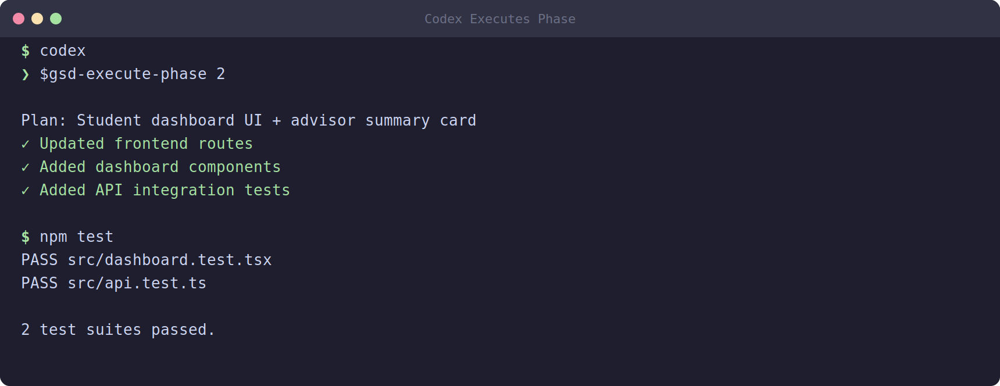

# 11 — Building with Codex + GSD Core

In the last module you built a phase using Claude Code. This module covers the same job with a different tool: **Codex CLI**. The good news is that almost everything you already learned transfers directly. The GSD (Get Stuff Done) Core workflow is the same regardless of which agent runs it — the parallel waves, the fresh contexts per executor, the read-plan-then-build sequence, the monitoring discipline. Only a few surface details change.

If you skipped Module 10, go back and read it first. This module assumes you understand waves, executors, and why we keep a human in the loop. Here we focus only on what is *different* about Codex.

## The one big difference: it is the same workflow

Let us be clear up front, because it is the most important point: **the GSD workflow is identical.** Codex reads your `PLAN.md`, splits the phase into parallel waves, spawns fresh executors for each task, creates files, runs tests, and commits — exactly like Claude Code does. The orchestration logic lives in GSD Core, not in the agent. The agent is just the engine that turns the plan into code.

The real distinction is which AI models do the thinking:

- **Claude Code** uses Anthropic models (the Claude family).
- **Codex** uses OpenAI models (such as `o3`, `gpt-4o`, and others).

Different model families have different strengths, costs, and availability. Some students will have an OpenAI subscription, others an Anthropic one, and some both. Pick whichever you have access to and prefer. Your planning documents do not care — they work with either.

## The command prefix: `$` instead of `/`

Here is the single syntax change you must remember. In Claude Code, GSD commands start with a slash:

```
/gsd-execute-phase 1
```

In Codex, the same commands start with a dollar sign:

```
$gsd-execute-phase 1
```

That is the whole difference in how you type the command. The phase number works the same way, and the command does the same thing — it reads your plan for Phase 1 and executes it in waves.

A quick memory trick: Claude uses the slash `/`, Codex uses the dollar `$`. Everything after the prefix is identical.

## Running a phase with Codex

The steps mirror the Claude path exactly:

1. Open a terminal and `cd` into your **project root** — the folder containing your `.planning/` directory and `PLAN.md`. As before, starting from the wrong directory means the agent cannot find your planning documents.
2. Start a Codex session in that directory.
3. At the prompt, type:

```
$gsd-execute-phase 1
```

Codex now reads `PLAN.md`, works out the wave dependencies, and begins building. You will see the same kind of output you saw with Claude: files being created, tests running, commits landing.


*Illustrative example — your terminal output will look similar but will differ based on your project, model, and system.*

## Choosing a Codex model

Codex lets you pick which OpenAI model to run. You set this when launching Codex with the `--model` flag:

```
codex --model o3
```

or

```
codex --model gpt-4o
```

Which one should you choose?

- **`o3`** is a strong reasoning model. It tends to do better on complex, multi-step coding tasks where careful thinking pays off. It may be slower and cost more per run.
- **`gpt-4o`** is fast and capable, a good default for most everyday building. It is often cheaper and quicker.

If you are unsure, start with `gpt-4o` for routine phases and reach for `o3` when a phase is logically tricky or you want extra rigor. You can change the model between phases — there is no rule that one project must use one model throughout.

## Monitoring works exactly the same

Because the workflow is identical, so is your job while it runs. Stay in the loop and watch for trouble. The same warning signs apply:

- **Off-spec features** — the agent adds something you never asked for. Stop it; scope creep is scope creep no matter which model wrote it.
- **Wrong assumptions** — the agent fills a gap in your spec with a wrong guess. Correct it right away.
- **Repeated test failures** — an executor stuck failing the same test may be confused. Read the error yourself and give it a hint.
- **File sprawl** — files in unexpected places, or far more files than the task needed.

When you spot a problem, type a correction, pause, or stop and restart the task. Catch issues early, in the first wave, before later waves build on top of a mistake.

Likewise, the supporting habits carry over: when execution finishes, check your state (the same progress-checking discipline from Module 10), and hold the agent to clean **Conventional Commits** (`feat:`, `fix:`, `docs:`, `test:`, and so on). Codex commits the same way Claude does, and a readable git history is just as valuable here.

## Choosing between Claude and Codex

You do not have to commit to one tool forever. Some practical guidance:

- Use whichever model family you have reliable access to.
- If you have both, you might use one for building and the other for reviewing — a second model can catch mistakes the first one missed (you will see this idea again in the review module).
- The cost and speed trade-offs differ between providers and between models within a provider. For a learning project, default to whatever is cheapest and fastest that still produces good code, and upgrade the model only when a phase genuinely needs more reasoning power.

The key takeaway: GSD Core makes your workflow **portable.** Your requirements, your `PLAN.md`, and your phase structure are the durable assets. The agent is swappable. Learn the workflow once and you can run it on any compatible agent.

## Wrapping up

Building with Codex is the same GSD workflow you already know, with two changes: the command prefix is `$` instead of `/`, and you choose an OpenAI model with `codex --model o3` or `codex --model gpt-4o`. Everything else — waves, fresh contexts, monitoring, commit discipline — is identical to the Claude Code path.

Whichever agent you used, once a phase is built you are not done. You need to verify that what was built actually matches what you asked for, then ship it. That is next.

[12 — Verify and Ship](12-verify-and-ship.md)
