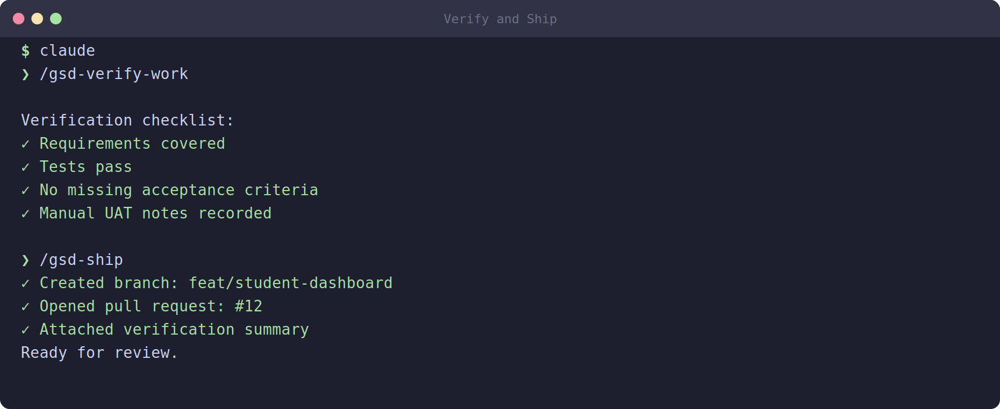

# 12 — Verify and Ship

The agent says it is done. The terminal stopped scrolling, the tests went green, and the commits look tidy. So the phase is finished, right?

Not yet. "The agent finished running" and "the phase actually does what I asked" are two different things. Agents are fast and confident, but confidence is not correctness. Before you call a phase done — and certainly before you build the next phase on top of it — you verify the work against your requirements, fix whatever is missing, and only then ship it.

This module covers the two GSD commands that close out a phase: `/gsd-verify-work` and `/gsd-ship`.

## `/gsd-verify-work N` — acceptance testing with auto-diagnosis

The verify command is your quality gate:

```
/gsd-verify-work 1
```

The `1` is the phase number you want to verify. Here is what it does:

- **Walks through what was built against `REQUIREMENTS.md`.** It takes your requirements document — the source of truth for what this phase was supposed to deliver — and checks the actual built code against it, requirement by requirement. This is user acceptance testing: not "do the tests pass?" but "does this satisfy what we promised?"
- **Identifies gaps.** Wherever the build falls short of a requirement, the command flags it. Maybe a feature is half-implemented, an edge case is unhandled, or a requirement was simply skipped.
- **Generates fix plans automatically.** This is the "auto-diagnosis" part. For each gap it finds, the command does not just complain — it produces a plan for how to fix it. You get an actionable list, not a vague warning.

**Run it before claiming a phase is done.** This cannot be overstated. Verification is cheap; shipping a broken phase and discovering the problem three phases later is expensive. Make `/gsd-verify-work N` a non-negotiable step in your routine.

## The verify-then-fix loop

Verification is rarely a one-shot pass on the first try, and that is normal. The expected pattern is a short loop:

```
verify → diagnose → fix → verify again
```

Step by step:

1. **Verify** — Run `/gsd-verify-work N`. It reports gaps.
2. **Diagnose** — The command auto-generates fix plans for those gaps. You read them and confirm they make sense.
3. **Fix** — Execute the fixes. You can hand the fix plans back to your building agent (the same `/gsd-execute-phase`-style flow from earlier modules) to implement them.
4. **Verify again** — Re-run `/gsd-verify-work N` to confirm the gaps are closed.

You repeat this loop until verification comes back clean — no gaps, every requirement satisfied. Each pass should find fewer issues than the last. When a verify run reports nothing left to fix, the phase has genuinely met its requirements and you are ready to ship.

Do not get discouraged if the first verify finds several issues. That is the system working as intended. The point of the loop is to catch those problems *now*, in a controlled way, instead of letting them hide in your codebase.


*Illustrative example — your verify/ship output will differ based on the phase, any gaps found, and your GitHub setup.*

## `/gsd-ship` — package up and open the PR

Once verification is clean, you ship:

```
/gsd-ship
```

Shipping is the formal close-out of a phase. The command does three things:

- **Creates a branch-specific PR via `gh pr create`.** It uses the GitHub CLI (`gh`) to open a pull request from your phase branch. A PR is the standard way to propose merging your work into the main branch — it bundles all the phase's changes into one reviewable unit with a description.
- **Marks the phase done in `STATE.md`.** GSD tracks overall project status in a state file. Shipping updates that file to record that this phase is complete, so `/gsd-progress` and future commands know where you are.
- **Archives the phase artifacts.** The planning documents, plans, and working files for the completed phase get archived. This keeps your active workspace clean and preserves a record of what was built and why, which is valuable if you ever need to look back.

After `/gsd-ship` runs, you have an open pull request waiting for review and a project state that correctly reflects a completed phase.

## After ship: merge and move on

Shipping creates the PR; it does not merge it. The final human steps are:

1. **Review the PR.** Look at the diff on GitHub (or hand it to a reviewer). Confirm the changes match what you expect. The next module covers how to review AI-generated code properly — do not skip it just because verification passed. Verification checks against your requirements; review checks for security, quality, and the things requirements documents do not capture.
2. **Merge the PR.** Once you are satisfied, merge it into your main branch. This makes the phase's work official.
3. **Move to the next phase.** With Phase 1 merged, you start Phase 2: plan it (if not already planned), then `/gsd-execute-phase 2`, then verify, then ship — the same cycle. Each phase builds on the verified, merged foundation of the ones before it.

This phase-by-phase rhythm — build, verify, fix, ship, merge, repeat — is the heartbeat of the whole workflow. It keeps each chunk of work small, checked, and trustworthy before the next chunk lands on top of it.

## A note on discipline

It is tempting, especially when you are excited and the tests are green, to skip verification and merge straight away. Resist this. The entire value of GSD is that it catches problems early and keeps your project honest against its own requirements. Every time you skip the gate, you are betting that the agent got everything right — and agents do not always get everything right.

The cost of one `/gsd-verify-work` run is a few minutes. The cost of discovering a missed requirement after you have built three more phases on top of it can be hours of untangling. Always verify before you ship.

## Wrapping up

You now know how to close out a phase: run `/gsd-verify-work N` to test the build against your requirements and auto-generate fix plans, work the verify → diagnose → fix → verify loop until it comes back clean, then run `/gsd-ship` to open the PR, update `STATE.md`, and archive the phase. After that, review and merge the PR, and move on to the next phase.

But there is one step we keep pointing to and have not yet detailed: reviewing the code the agent wrote. Verification checks requirements; review checks everything else. Next module.

[13 — Reviewing AI Code](13-reviewing-ai-code.md)
