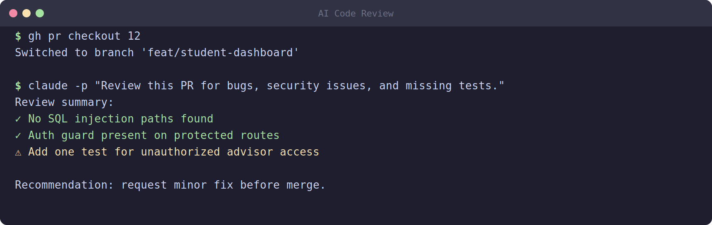

# 13 — Reviewing AI-Generated Code


*Illustrative example — an agent's review pass against a PR. Your output will differ based on the diff and the issues found.*

Here is the rule that underlies this entire module, and you should tattoo it on your brain:

**Never merge AI-generated code without review.**

Agents are remarkably fast and remarkably often correct. But "often" leaves room for "sometimes wrong," and when an agent is wrong it is wrong with total confidence and at high speed. It will write a hundred lines of plausible, well-formatted, completely incorrect code and commit it with a tidy message. The verification step from Module 12 checks the build against your requirements, but it does not catch everything. The final line of defense is review — both an automated pass and your own human eyes.

## Common mistakes agents make

Knowing what tends to go wrong tells you where to look. AI coding agents have recurring failure patterns:

- **Hardcoded secrets.** The agent needs an API key or password to make something work, so it pastes one directly into the source code instead of reading it from an environment variable or secrets manager. This is a serious security hole — secrets in code get committed to git history and leak.
- **Missing edge cases.** The agent handles the "happy path" (valid input, everything present) but forgets the messy reality: empty strings, null values, negative numbers, enormous inputs, the user who clicks the button twice.
- **No input validation.** The code trusts whatever it receives. Untrusted input flowing straight into a database query or a file path is how injection attacks and crashes happen.
- **Off-spec features.** The agent adds something nobody asked for, or implements a requirement differently than specified. Extra code is extra surface area for bugs and confusion.
- **Skipped tests.** The agent writes a test that does not actually assert anything meaningful, marks a test as skipped, or deletes a failing test instead of fixing the underlying problem. Green tests that do not test anything are worse than no tests, because they create false confidence.

When you review, you are hunting for exactly these patterns.

## The review checklist

Work through this checklist for every phase before you approve it:

1. **Spec conformance.** Trace every change back to a requirement. In a well-run project, each requirement has an identifier — an **F-ID** (feature ID). For each meaningful change in the diff, you should be able to point to the F-ID it implements. If a change does not map to any requirement, ask why it exists. If a requirement has no corresponding change, it was skipped.
2. **Security scan.** Look for hardcoded secrets, missing input validation, unsafe handling of user data, overly broad permissions, and anything touching authentication or money. These deserve extra scrutiny.
3. **Test coverage.** Are there tests for the new code? Do they actually assert correct behavior, including edge cases? Are any tests skipped or hollow? Run the tests yourself and watch them pass — do not trust a report.
4. **Code quality.** Is the code readable? Are names clear? Is there duplicated logic that should be shared? Is error handling present? You do not need perfection, but you should not be merging code you cannot understand.
5. **DB schema.** If the phase touched the database, review schema changes carefully. Migrations are hard to undo once data lands on them. Check that columns, types, indexes, and constraints make sense and match the requirements.

## Using the agent as a secondary reviewer

You can — and should — enlist an AI agent to do a first pass of the review. A fresh agent reading the diff with no attachment to the code that wrote it can flag a surprising number of issues quickly. Run something like this from your shell:

```
claude -p "Review all changes on this branch vs main.
Check against .planning/REQUIREMENTS.md.
Flag: security issues, missing tests, spec deviations.
List every issue by file:line." --allowedTools Read,Bash --max-turns 8
```

Notice the details:

- The prompt asks for a **diff against `main`**, so the reviewer focuses only on what changed in this phase.
- It points the reviewer at **`.planning/REQUIREMENTS.md`** so spec deviations can be caught against the real source of truth.
- It asks for issues **listed by file:line**, which makes them easy to find and fix.
- `--allowedTools Read,Bash` gives the reviewer only what it needs: read files and run commands (like the test suite or `git diff`). It cannot edit or write — a reviewer should not be changing code.
- `--max-turns 8` caps the run so it stays focused and inexpensive.

A neat trick: if you built with one model family, review with the other. Have Codex (OpenAI) review what Claude (Anthropic) built, or vice versa. Different models notice different things, and a model reviewing its own work has the same blind spots it had while writing.

## Human review is still mandatory

The agent reviewer is a helper, not a replacement. **You must read the diff yourself — not just the summary.**

Summaries lie by omission. An agent might summarize a change as "added user login" while the actual diff contains a hardcoded admin password and a disabled CSRF check. The summary sounds fine; the code is dangerous. The only way to catch this is to read the actual changed lines.

When you review the diff:

- Read every changed file, top to bottom. For large diffs, prioritize anything touching security, data, money, or authentication.
- For each change, silently ask: *What requirement does this serve? What happens if the input is bad? What happens if this fails?*
- Be especially suspicious of anything you do not understand. "I'll trust it, it probably works" is how bugs ship. If you cannot explain what a piece of code does, do not approve it — ask the agent to explain it, or rewrite it until you can.

This is a skill that improves with practice. The more diffs you read, the faster you spot the patterns from the "common mistakes" section above.

## Requesting changes

If your review (automated, human, or both) turns up problems, you do not merge — you request changes on the pull request. Using the GitHub CLI:

```
gh pr review <N> --request-changes --body "..."
```

Replace `<N>` with the PR number and put your specific feedback in the `--body`. Be concrete: reference the file and line, state what is wrong, and say what you want instead. For example: *"src/auth.py:42 — API key is hardcoded; load it from an environment variable. src/users.py:88 — no validation on the email field; reject malformed addresses."*

Then hand that feedback back to your building agent to fix, re-verify (Module 12's loop), and review again. The cycle repeats until the PR is clean.

## Approval and merge

When the review is genuinely clean — checklist satisfied, no outstanding issues, you understand the diff — you approve and merge:

```
gh pr review <N> --approve && gh pr merge <N> --squash
```

This approves the pull request and then merges it. The `--squash` flag combines all the phase's commits into a single, clean commit on your main branch. Squashing keeps your project history tidy: one phase becomes one logical commit, rather than a noisy trail of every intermediate step the agent took. (Some teams prefer to keep all commits; squash is a sensible default for a learning project.)

Once merged, the phase is officially part of your main branch, and you are ready to move on.

## Wrapping up

Reviewing AI-generated code is not optional — it is the discipline that makes AI-assisted development trustworthy. Never merge without review. Know the common failure patterns (hardcoded secrets, missing edge cases, no validation, off-spec features, hollow tests). Work the checklist: spec conformance by F-ID, security, test coverage, code quality, DB schema. Use an agent as a fast first-pass reviewer, ideally a different model family than the one that wrote the code. Then read the diff yourself, because summaries hide problems. Request changes when needed, and only approve and squash-merge when the code is genuinely clean.

You have now been through the entire cycle: plan, build with Claude or Codex, verify, ship, and review. That is a complete project loop. When you are ready to start something new, head back to the beginning and run it again — each project will go faster and cleaner than the last.

[Back to Module 00 — start your next project](00-mindset.md)
